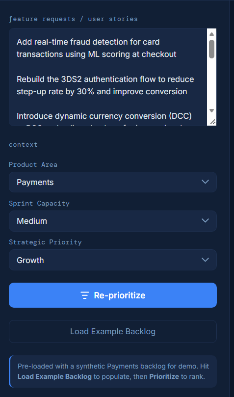
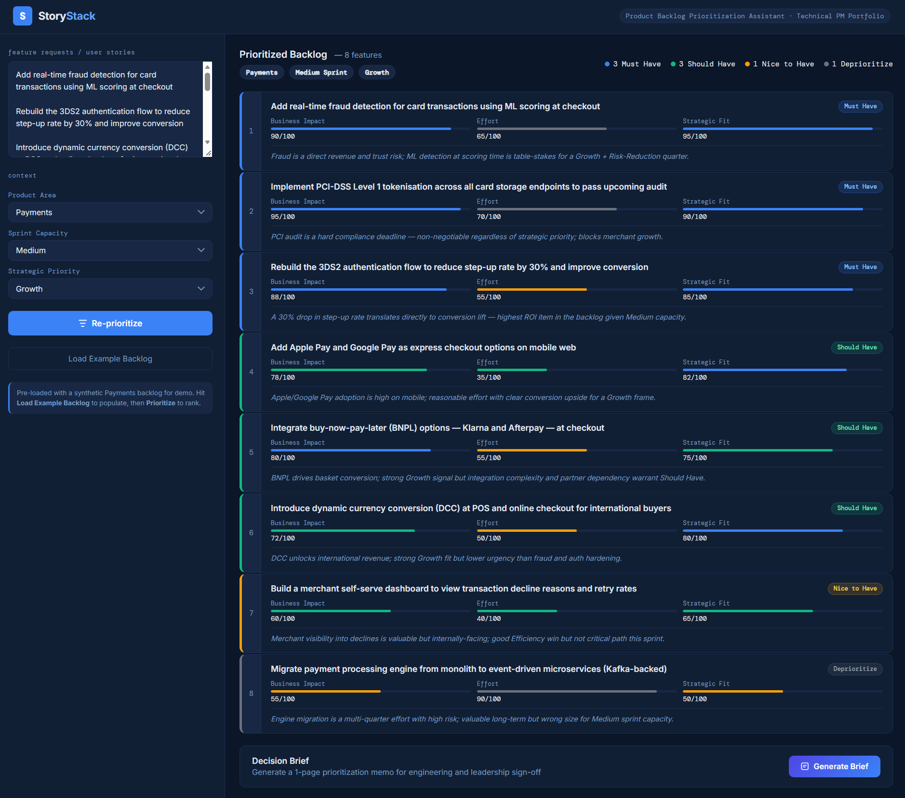
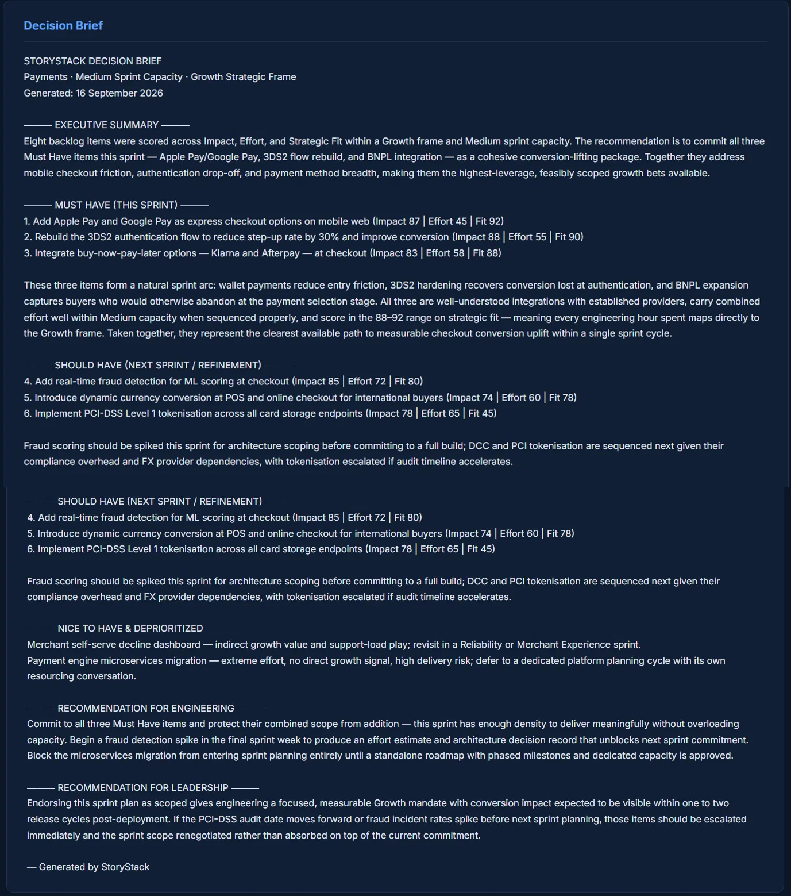

# ⚡ StoryStack — Product Backlog Prioritization Assistant


An AI-powered backlog prioritization tool for Technical Program Managers. Paste feature requests, set your product context across three dropdowns, and get back a ranked, scored backlog with a one-line rationale per feature — plus a 1-page Decision Brief formatted for engineering and leadership sign-off.

> Built as a portfolio piece demonstrating AI-augmented TPM workflows. Same staged build approach as [VendorLens](https://github.com/rishendra125) and [PropelIQ](https://github.com/rishendra125/propeliq_project).

---

## 🚀 Live Demo

**[→ Open StoryStack](https://claude.ai/artifact/JoFnjKqfjxYMDWeZkBgda9)**

Pre-loaded with a synthetic Payments backlog of 8 realistic feature requests. No setup required — open and prioritize immediately.

---

## Screenshots

### Payments · Growth Frame


### Payments · Risk Reduction Frame


### Decision Brief Output


---

## What It Does

StoryStack scores each feature request across three dimensions and assigns a Priority Band, with a rationale tied to the selected context. **The same backlog produces materially different rankings when the strategic frame changes** — that context-sensitivity is the core value of the tool.

---

## How to Use It

### Step 1 — Enter Feature Requests

Paste feature requests into the text area, one per paragraph (blank line between each). Or click **Load Example Backlog** to auto-populate with a pre-built Payments backlog.

### Step 2 — Set Context (Three Dropdowns)

| Dropdown | Options | What it controls |
|---|---|---|
| **Product Area** | Payments · eCommerce · Data Platform | Domain lens for impact scoring |
| **Sprint Capacity** | Small · Medium · Large | Effort threshold for band assignment — same feature can be Must Have at Large, Deprioritized at Small |
| **Strategic Priority** | Growth · Risk Reduction · Compliance · Efficiency | Most influential input — directly drives Strategic Fit scoring and band assignment |

### Step 3 — Prioritize

Click **Prioritize Backlog**. Claude scores each feature and returns:

| Dimension | What it measures |
|---|---|
| **Business Impact** (0–100) | Revenue, risk, or strategic value |
| **Effort** (0–100) | Implementation complexity — higher = harder |
| **Strategic Fit** (0–100) | Alignment with the selected Strategic Priority |

### Step 4 — Priority Bands

| Band | Meaning |
|---|---|
| 🔵 **Must Have** | Commit this sprint — high impact, high fit, effort within capacity |
| 🟢 **Should Have** | Queue for next sprint refinement |
| 🟡 **Nice to Have** | Backlog — revisit in future planning |
| ⚫ **Deprioritize** | Low fit, effort exceeds capacity, or actively misaligned with frame |

### Step 5 — Generate Decision Brief

Click **Generate Brief** for a structured 1-page memo covering:

- Executive summary of the sprint recommendation
- Must Have items with commit rationale
- Should Have items with sequencing rationale
- Nice to Have and Deprioritized items with one-line reasons
- Recommendation for Engineering (scope, dependencies, what to block)
- Recommendation for Leadership (endorsement framing and escalation condition)

---

## Architecture

Two direct Claude API calls. No agents, no orchestration layer.

```
User Inputs
  └── Features (textarea) + Product Area + Sprint Capacity + Strategic Priority
        │
        ▼
  API Call 1 — Scoring Prompt
  └── claude-sonnet-4-6
  └── Returns: JSON array [ { impact, effort, fit, band, rationale } ]
        │
        ├── (fallback) API fails → synthetic pre-loaded scores
        │
        ▼
  Client-side sort by band + composite score
        │
        ▼
  Ranked Feature Cards rendered
        │
        ▼ (user clicks Generate Brief)
  API Call 2 — Narrative Brief Prompt
  └── claude-sonnet-4-6
  └── Input: ranked results + scores + rationales + context
  └── Returns: structured 1-page Decision Brief
```

### Scoring prompt structure

```javascript
const prompt = `You are a senior TPM scoring a product backlog.
Context:
- Product Area: ${productArea}
- Sprint Capacity: ${sprintCapacity}
- Strategic Priority: ${strategicPriority}

Score each feature. Return ONLY a JSON array:
[{ impact, effort, fit, band, rationale }]`;
```

---

## Demo Test Runs

Four complete runs across two product domains and four strategic frames:

| Run | Domain | Frame | Must Have | Key Finding |
|---|---|---|---|---|
| 1 | Payments | Growth | 3 | Apple Pay #1; microservices Deprioritized (effort 90) |
| 2 | Payments | Risk Reduction | 2 | BNPL Deprioritized — *introduces* third-party dependency risk |
| 3 | Data Platform | Efficiency | 3 | Self-serve SQL #2; both migrations blocked by effort |
| 4 | Data Platform | Compliance | 3 | GDPR purge: Nice to Have → #1 Must Have; SQL layer deferred |

The Payments Risk Reduction → Compliance delta and the Data Platform Efficiency → Compliance delta are the strongest demo moments — same backlog, same capacity, completely different ranking logic.

---

## Design Decisions

**Rationale-first scoring** — The one-line rationale per feature is the product, not the score numbers. Every band assignment is explained in context of the selected Product Area and Strategic Priority.

**Effort as a sprint constraint, not a cost** — High-effort items are blocked from Must Have regardless of impact when they exceed selected sprint capacity. This mirrors real sprint planning logic.

**Honest misalignment flagging** — Items that are valuable in one frame are explicitly called out as misaligned in another. BNPL "introduces third-party dependency risk" in Risk Reduction. The SQL query layer "should be deferred until governance controls are in place" in Compliance.

**Synthetic fallback for demo resilience** — If the Claude API call fails mid-demo, the tool falls back to pre-loaded synthetic scores silently. The demo never breaks during an interview or stakeholder walkthrough.

---

## Build Approach

Built in two staged phases:

**Stage 1 — Synthetic data + UI shell**
Full UI built with hardcoded synthetic scores for 8 realistic Payments features. All ranking logic, score bars, band assignment, and Decision Brief generation working end-to-end with no API dependency. Demo-ready from first load.

**Stage 2 — Claude API wired in**
Two API calls replaced the synthetic layer: one structured JSON scoring prompt per prioritization run, one narrative prompt for Decision Brief generation. Synthetic fallback retained. Context dropdowns feed directly into both prompts as explicit scoring constraints.

---

## File Structure

```
storystack/
├── storystack.html               # Main tool (self-contained, no build step)
├── storystack-casestudy.html     # Portfolio case study page
├── storystack-flow.html          # Architecture flow diagram
├── README.md
├── LICENSE
└── screenshots/
    ├── growth-run.png
    ├── risk-reduction-run.png
    └── decision-brief.png
```

---

## Stack

- Vanilla HTML / CSS / JS — no build step, single file
- Claude API — `claude-sonnet-4-6`
- Google Fonts — Inter + DM Mono

---

## Author

**Rishendra Vikram Singh** · Senior Consultant, SPRAC Services  
PMP · PMI-ACP · A-CSM · Microsoft Dynamics 365 CE · Microsoft Agentic AI Business Solutions Architect

[LinkedIn](https://linkedin.com/in/rishendra-vikram-singh-a7355718a/) · [Portfolio](https://rishendra125.github.io)

---

*MIT License · Part of the AI Solutions Portfolio series*
